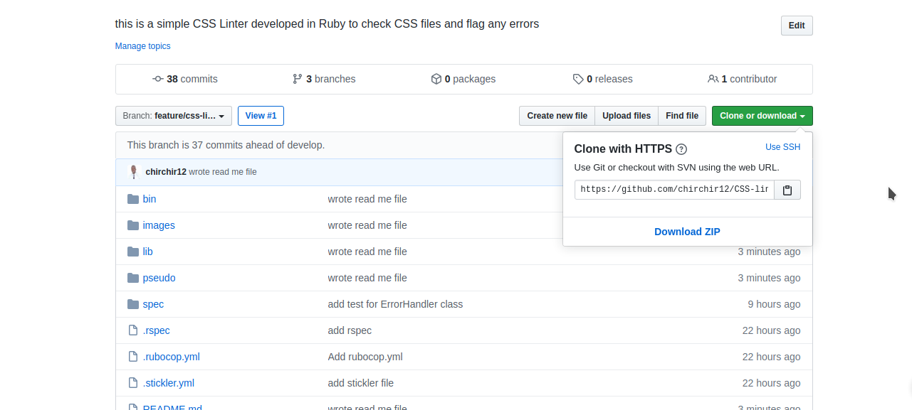

# Capstone Project: CSS Linter

this is a CSS Linter developed in Ruby to help highlight sytle errors in CSS. It provides feedback when there are offences in the file. These offences include indentation, trailing white spaces, space before semi-colon, single space before and after colon, and missing semi colon. The linter print error and its corresponding line in the file.

## Built With

- Ruby-2.5.1p57
- Rspec
- colorize


## User Guide
#### missing Semicolon
the following is considered violation
```
#active {
color : aliceblue
}

```
the following is not considered violation
```
#active {
color : aliceblue;
}

```
#### space Before Semicolon
the following is considered violation
```
.bg-black {
  background-color: #000 ;
}

```
the following is not considered violation
```
.bg-black {
  background-color: #000;
}

```

#### Indentation
the following is considered violation
```
body {
margin: 0;
}

```
the following is not considered violation
```
body {
  margin: 0;
}

```
#### Empty Blocks
the following is considered violation
```
body>#chirchir {
  
}
```
the following is not considered violation: you can delete the rule altogether
```
body>#chirchir {
  color:blue
}

```
#### Single Space After Colon
the following is considered violation
```
.bg-white-black-text {
  color:#000;
}

```
the following is not considered violation
```
.bg-white-black-text {
  color: #000;
}

```

#### Trailing Whitespaces
the following is considered violation: notice space at the end of rule
```
.d-flex-vertical-center-column {
  justify-content: center; 
}
```
the following is not considered violation
```
.d-flex-vertical-center-column {
  justify-content: center;
}

```
## Demo

### bad code

```
.bg-black {
  background-color:#000
}

.bg-white-black-text {
  color: #000;
}

.d-flex-vertical-center-column {
  justify-content: center ;
flex-direction: column
}

```


### Good code

```
#color {
    color : aliceblue;
    background-color : #6688;
    border : 50px;
    }

```


## How to Use

1. From bin folder right click on the main file and select open with terminal option
2. pass the path to the css file to the linter like so `lint assets/css/file.css`

### How to install using Command line

    1. Click on the install or download button under the repository name and grab the url
    by clicking on the clipboard icon



    2.open your terminal

    3.Navigate to the location in your computer where you want the repo to be cloned

    4. Type git clone  and paste the url you copied on step one.

        $ git clone https://github.com/YOUR-USERNAME/YOUR-REPOSITORY

    5. Press Enter. Your local clone will be created.

    6. move into the directory created
    7. run `bundle install` to install dependencies
    8. run `bin/lint path_to/file.css`

## Testing 
run ` bundle exec rspec` to see test passing all checks

## Author

👤 **Author**

- Github: [@githubhandle](https://github.com/chirchir12)
- Twitter: [@twitterhandle](https://twitter.com/shadochir)
- Linkedin: [linkedin](https://www.linkedin.com/in/emmanuel-chirchir/)
- Email: [email](chirchir7370@gmail.com)

## 🤝 Contributing

    Contributions, issues and feature requests are welcome!

Feel free to check the [issues page](https://github.com/chirchir12/TicTacToe/issues).

## Show your support

Give a ⭐️ if you like this project!

## Acknowledgments

- [Microverse](https://www.microverse.org/)
- [Odin Project](https://www.theodinproject.com//)
- [Github](https://github.com/)

## 📝 License

This project is [MIT](lic.url) licensed.
